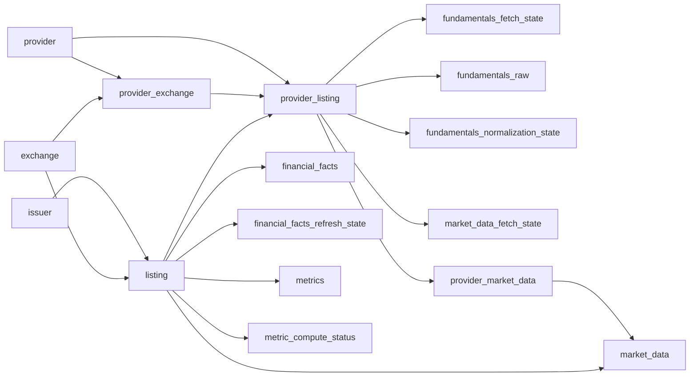
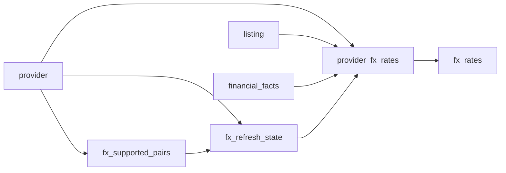

# Relationships

The identity/catalog layer and the large downstream analytical tables all use physical foreign keys. Migrations 041, 043, and 046–050 added the previously-missing physical FKs on `metrics`, `metric_compute_status`, `financial_facts`, `financial_facts_refresh_state`, `market_data`, `fx_rates`, `fx_supported_pairs`, and `fx_refresh_state`, so referential integrity is enforced by SQLite (`PRAGMA foreign_keys = ON`) rather than application code. Migrations 081–084 split the two observation stores into provider/canonical pairs: `provider_market_data` (FK to `provider_listing`) mirrors into canonical `market_data`, and `provider_fx_rates` (FK to `provider`, superseding the old `fx_rates.provider` FK from 048) mirrors into the now provider-free canonical `fx_rates`.

## Canonical Identity Flow

## FX Flow

## Relationship Notes

- `provider.provider_id` is the catalog FK key; `provider.provider_code` remains the stable external namespace.
- `provider_exchange` maps provider exchange codes to canonical `exchange.exchange_id`.
- `listing.listing_id` is the canonical downstream key for facts, prices, metrics, and primary-listing status.
- `provider_listing.provider_listing_id` replaces `(provider, provider_symbol)` as the durable provider-scoped raw/state key. It also keys the provider-layer price store `provider_market_data` (like `fundamentals_raw`), whose observations are mirrored into canonical `market_data` at write time.
- The `provider_market_data --> market_data` and `provider_fx_rates --> fx_rates` arrows are write-time promotion, not physical FKs: canonical rows share the natural key (`listing_id`/pair + date) with their provider observations and are provider-free by design, so a second provider can be added without touching downstream readers. Canonical data is never purged; the delisting cascade removes only provider-layer rows.
- User-facing canonical symbols such as `AAPL.US` are derived from `listing.symbol` plus `exchange.exchange_code`.
- FX discovery reads currencies from `listing` and `financial_facts` to plan what to fetch into the provider layer, but FX storage itself is not keyed back to a listing.
