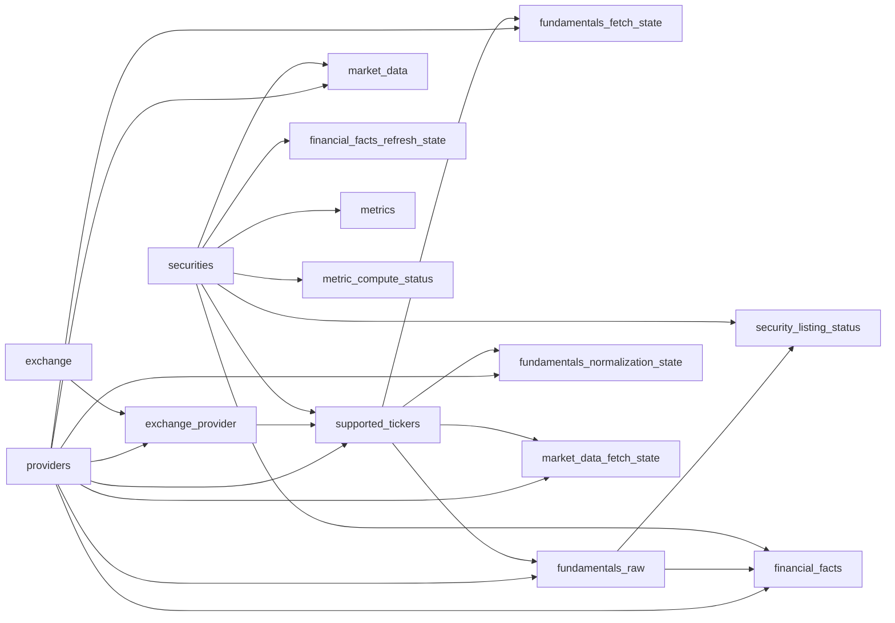
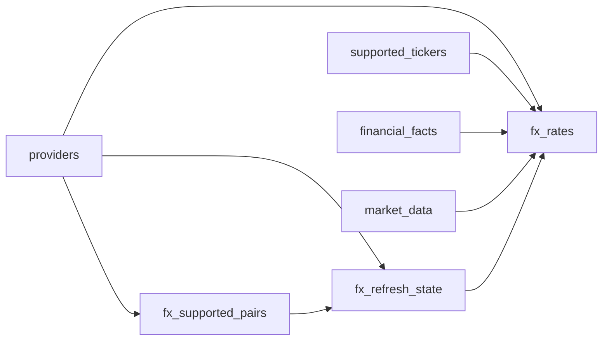

# Relationships

`pyvalue` still mostly uses logical references instead of enforced foreign keys, but the exchange-catalog split now enforces two physical links inside `exchange_provider`.

## Canonical Identity Flow

## FX Flow

## Relationship Notes

- `providers.provider_code` is a narrow registry key for the provider namespaces already denormalized across the rest of the schema.
- `exchange_provider.provider -> providers.provider_code` and `exchange_provider.exchange_id -> exchange.exchange_id` are the only enforced exchange-catalog foreign keys today.
- `exchange.exchange_id` is the new canonical exchange key, but downstream tables still continue to use `canonical_exchange_code` in this phase.
- `securities.security_id` is the canonical key for downstream facts, market data, and metrics.
- `supported_tickers` is the provider-facing hub. Most provider-scoped state tables key off `(provider, provider_symbol)` rather than `security_id`.
- `security_listing_status` is intentionally keyed by `security_id` so downstream scope filters can work from canonical identity.
- FX discovery reads currencies from `supported_tickers`, `financial_facts`, and `market_data`, but FX storage itself is not keyed back to a security.
- Outside `exchange_provider`, orphan prevention still depends on application logic, migrations, and periodic integrity checks.
